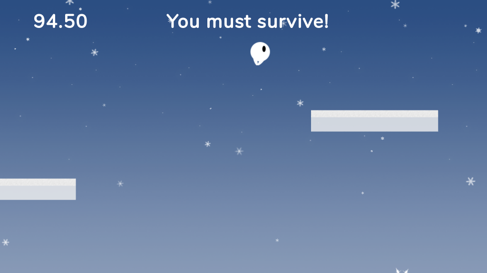

# ACM Workshop2017 - You Must Survive

## Getting Started
* Download and install nodeJs with npm: https://nodejs.org/en/download/
* Install git bash: https://git-for-windows.github.io/
* Clone the repo: `git clone <repolink>`

* Move to the repo folder, right click and run git bash there
* Execute `npm install`

* Start the dev server with `npm run dev`
* Open your browser and go to http://localhost:9000/

## PhaserJs documentation
https://phaser.io/docs/2.6.2/index

## TypeScript documentation
https://www.typescriptlang.org/docs/handbook/basic-types.html
